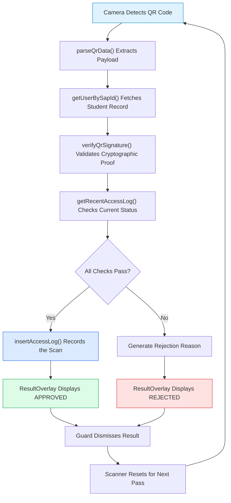
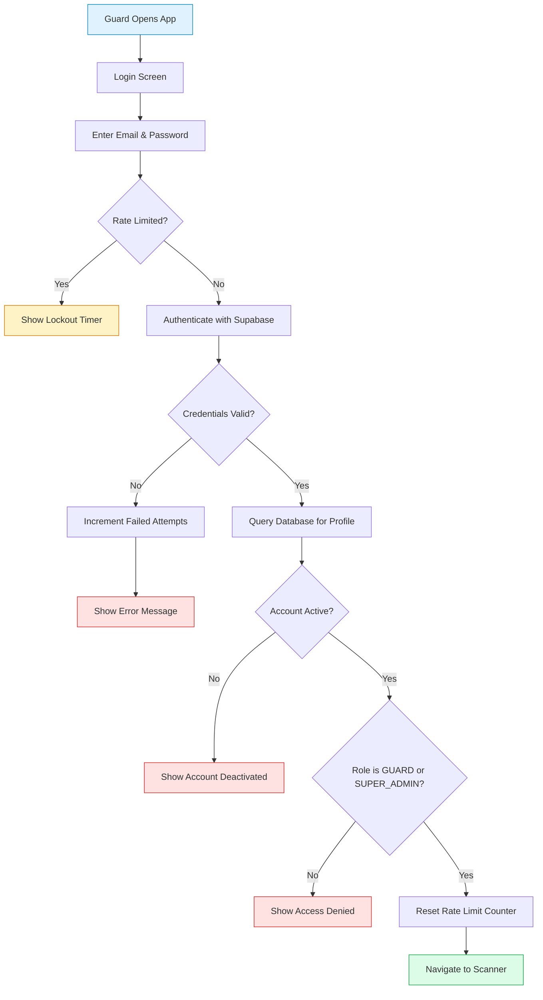
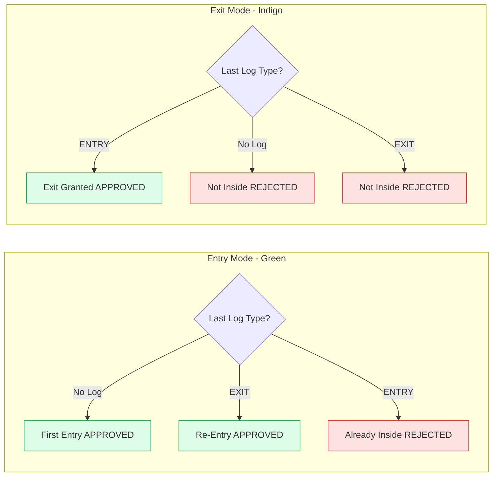
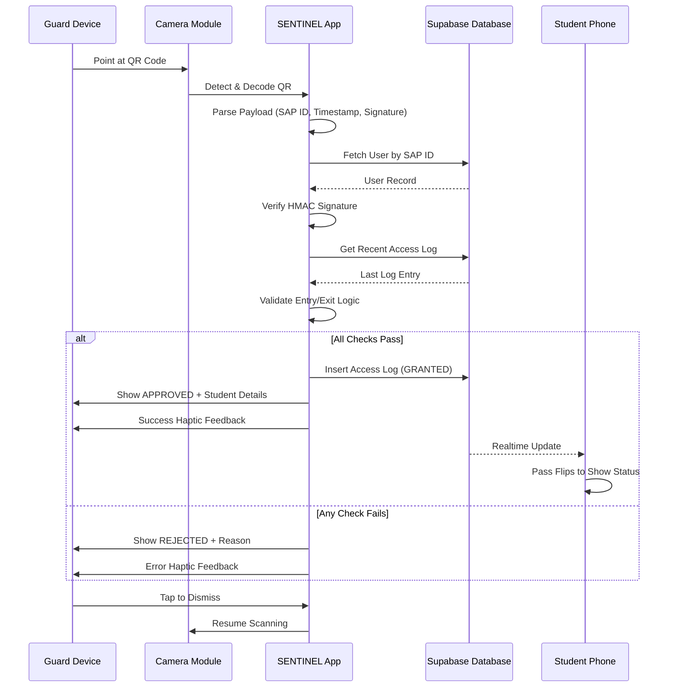

<div align="center">

# SENTINEL Guard Mobile Application

### Complete Operational Flow Documentation

**A comprehensive guide to understanding the mobile scanning application used by security personnel for venue access control.**

</div>

---

## Table of Contents

1. [Introduction](#introduction)
2. [Application Purpose](#application-purpose)
3. [Installation and Setup](#installation-and-setup)
4. [Authentication Flow](#authentication-flow)
5. [Scanner Interface](#scanner-interface)
6. [Verification Process](#verification-process)
7. [Result Handling](#result-handling)
8. [History and Logging](#history-and-logging)
9. [Profile Management](#profile-management)
10. [Security Considerations](#security-considerations)
11. [Troubleshooting](#troubleshooting)

---

## Introduction

The SENTINEL Guard mobile application is a purpose-built tool designed for security personnel stationed at event venue entry and exit points. Unlike the web application which serves multiple user types, this mobile app serves a single, focused purpose: rapidly verify student digital passes and maintain accurate entry/exit records.

This document explains every aspect of the application, from first launch to operational use, written so that both technical and non-technical readers can understand the system.

---

## Application Purpose

### What Does This App Do?

The Guard app transforms a standard smartphone or tablet into a professional-grade QR code scanner capable of:

1. **Reading Student Passes**: Scanning the QR codes displayed on students' phones
2. **Validating Authenticity**: Verifying that the pass is genuine and not copied or forged
3. **Checking Status**: Confirming the student is authorized to enter (paid, not already inside)
4. **Recording Access**: Logging every entry and exit to the central database
5. **Providing Feedback**: Showing the guard clear approval or denial with relevant details

### Who Uses This App?

The application is designed for two types of authorized personnel:

| Role            | Purpose                                     |
| --------------- | ------------------------------------------- |
| **GUARD**       | Security personnel stationed at venue gates |
| **SUPER_ADMIN** | Administrators who may assist with scanning |

No other roles can log into this application. Students, Class Representatives, and Girls Representatives must use the web application instead.

---

## Installation and Setup

### Device Requirements

The SENTINEL Guard app is built using React Native and Expo, supporting:

- **iOS**: iPhone or iPad running iOS 13 or later
- **Android**: Devices running Android 8.0 (Oreo) or later

### Camera Permissions

The app requires camera access to scan QR codes. Upon first launch:

1. The app requests camera permission
2. A dialog explains why the camera is needed
3. The user must grant permission to proceed
4. If denied, the app displays instructions to enable in device settings

### Network Requirements

Active internet connectivity is required for:

- User authentication
- Database validation of scanned passes
- Real-time logging of entry/exit events

The app does not support offline scanning because verification requires live database queries to check current student status.

---

## Authentication Flow

### Login Screen

When launching the app, guards encounter a secure login screen featuring:

- **Application Branding**: SENTINEL GUARD title with security iconography
- **Email Field**: For entering the guard's assigned email address
- **Password Field**: Secure input with visibility toggle
- **Login Button**: Initiates authentication process

### Security Measures

The login process implements multiple protective measures:

#### Rate Limiting

To prevent brute-force attacks (repeated password guessing):

| Metric                  | Value                  |
| ----------------------- | ---------------------- |
| Maximum Failed Attempts | 5                      |
| Lockout Duration        | 15 minutes             |
| Attempt Counter Reset   | After successful login |

When lockout activates:

- The login button becomes disabled
- A warning banner displays remaining lockout time
- A countdown updates every 30 seconds

#### Account Verification

Upon entering credentials, the app performs multi-step verification:

```
Step 1: Authenticate with Supabase
        ↓
Step 2: Query database for user profile
        ↓
Step 3: Verify account is active
        ↓
Step 4: Confirm role is GUARD or SUPER_ADMIN
        ↓
Step 5: Grant access to scanner
```

If any step fails, the guard receives a specific error message:

| Error Condition         | Message Displayed                                   |
| ----------------------- | --------------------------------------------------- |
| Wrong email/password    | "Invalid credentials"                               |
| Account not in database | "Account not found in system. Contact admin."       |
| Account deactivated     | "Your account has been deactivated"                 |
| Unauthorized role       | "Access Denied: Guard or Admin privileges required" |

### Successful Login

When authentication succeeds:

1. Rate limit counter resets
2. Session is established
3. App navigates to scanner interface
4. Guard is ready to scan passes

---

## Scanner Interface

### Main Layout

The scanner screen presents a clean, focused interface optimized for rapid scanning:

#### Camera Viewfinder

The full-screen camera view displays:

- **Scanning Frame**: Corner brackets indicating where to position QR codes
- **Frame Coloring**: Green corners for Entry mode, Indigo for Exit mode
- **Instructional Text**: "Point at QR Code" guidance below the frame

#### Top Controls

A control bar at the top provides quick access to:

| Control          | Function                                           |
| ---------------- | -------------------------------------------------- |
| **Flash Toggle** | Enable/disable flashlight for low-light conditions |
| **Mode Toggle**  | Switch between ENTRY and EXIT scanning modes       |

### Entry vs Exit Mode

Guards must select the appropriate mode based on their station:

#### Entry Mode (Green)

Used when stationed at venue entrance gates:

- Validates that the student is not already inside
- Records an ENTRY log upon successful scan
- Confirms this is the student's authorized admission

#### Exit Mode (Indigo)

Used when stationed at venue exit gates:

- Validates that the student is currently inside
- Records an EXIT log upon successful scan
- Updates student status to allow future re-entry

### Mode Switching

Guards can switch modes at any time by tapping the toggle buttons. This is useful for:

- Staff rotating between entrance and exit duties
- Emergency situations requiring all gates to function as exits
- Venues with combined entry/exit checkpoints

---

## Verification Process

### What Happens When a QR Code is Scanned

The moment a student's QR code enters the scanning frame, a rapid sequence of events occurs:

### Step 1: QR Code Parsing

The camera detects and reads the QR code content. The encoded data contains:

- **SAP ID**: The student's university identification number
- **Timestamp**: When the QR code was generated
- **Signature**: Cryptographic proof of authenticity

If the QR code format is invalid (not a SENTINEL pass), the scan immediately fails with "Invalid QR Code."

### Step 2: Database Lookup

The app queries the central database to retrieve the student's record using their SAP ID:

```
Query: SELECT * FROM users WHERE sap_id = [scanned_id]
```

If no matching student exists, the scan fails with "ID Not Found."

### Step 3: Status Validation

The system checks multiple conditions:

| Check                                      | Failure Message    |
| ------------------------------------------ | ------------------ |
| Is the student's account paid?             | "Payment Pending"  |
| Is the account active (not banned)?        | "Pass Deactivated" |
| Does the student have an activation token? | "No Token"         |

All checks must pass for verification to continue.

### Step 4: Signature Verification

The app generates its own signature using:

- The same SAP ID and timestamp from the scanned QR
- The student's secret activation token from the database

If the generated signature matches the scanned signature, the pass is authentic. If not, the scan fails with "Invalid Signature."

This mechanism ensures:

- Screenshots of other students' passes cannot work (wrong token)
- Photoshopped QR codes are detected immediately
- Pass sharing between students is impossible

### Step 5: Double-Entry Prevention

Depending on the current mode:

#### Entry Mode Checks

| Current Status                  | Result                          |
| ------------------------------- | ------------------------------- |
| Student not inside              | APPROVED                        |
| Student was inside, then exited | APPROVED (marked as "Re-Entry") |
| Student already inside          | REJECTED ("Already Inside")     |

#### Exit Mode Checks

| Current Status        | Result                  |
| --------------------- | ----------------------- |
| Student is inside     | APPROVED                |
| Student is not inside | REJECTED ("Not Inside") |

### Step 6: Access Logging

If all checks pass:

1. An access log entry is created in the database
2. The log includes: student ID, scanner ID, timestamp, gate, and status
3. The student's digital pass updates in real-time
4. The guard sees the approval screen

---

## Result Handling

### Scan Lock Prevention

To prevent accidental double-scans, the app implements a scan lock:

1. Upon detecting a QR code, scanning is immediately paused
2. Verification proceeds while scanning remains locked
3. Result is displayed
4. Guard must acknowledge the result to unlock scanning
5. Brief 200ms delay ensures clean reset before next scan

### Approval Display

When a scan is approved, the guard sees a comprehensive confirmation:

| Information                | Purpose                                       |
| -------------------------- | --------------------------------------------- |
| **Large Status Indicator** | Green "APPROVED" confirmation                 |
| **Student Name**           | Verify this is the person presenting the pass |
| **Profile Photo**          | Visual confirmation of identity               |
| **SAP ID**                 | Reference number for logging                  |
| **Semester/Section**       | Additional verification context               |
| **Re-Entry Badge**         | Indicates if student is returning after exit  |

#### Haptic Feedback

The device provides tactile confirmation:

- **Success Pattern**: Distinct vibration indicating approval
- **Purpose**: Guards can confirm results without looking at screen

### Rejection Display

When a scan is denied, the display shows:

| Information                | Purpose                     |
| -------------------------- | --------------------------- |
| **Large Status Indicator** | Red "REJECTED" warning      |
| **Denial Reason**          | Specific cause of rejection |

Common rejection reasons and their meanings:

| Reason            | Explanation                          |
| ----------------- | ------------------------------------ |
| Invalid QR Code   | Not a SENTINEL pass or corrupted     |
| ID Not Found      | Student not registered in system     |
| Payment Pending   | Student hasn't paid for event        |
| Pass Deactivated  | Administrator banned this student    |
| Invalid Signature | Likely a screenshot or forgery       |
| Already Inside    | Student scanned entry twice          |
| Not Inside        | Student trying to exit without entry |

#### Haptic Feedback

For rejections:

- **Error Pattern**: Sharp vibration indicating denial
- **Purpose**: Immediately alerts guard to verify situation

### Dismissing Results

After viewing the result, guards tap anywhere on the screen to:

1. Dismiss the result overlay
2. Reset the scanner for the next pass
3. Resume camera viewfinder display

---

## History and Logging

### History Tab

The app maintains a local log of scans performed during the current session. Accessed via the bottom navigation:

#### Log Entry Information

Each entry displays:

- **Student Name**: Who was scanned
- **Timestamp**: When the scan occurred
- **Type**: ENTRY or EXIT
- **Status**: GRANTED or REJECTED

#### Use Cases

The history serves multiple purposes:

1. **Quick Reference**: Recall recent scans without database lookup
2. **Dispute Resolution**: Verify when a specific student was scanned
3. **Activity Tracking**: Guards can review their scan volume

### Database Logging

Beyond the local history, every scan creates a permanent database record:

| Field       | Description                     |
| ----------- | ------------------------------- |
| User ID     | Which student was scanned       |
| Scanner ID  | Which guard performed the scan  |
| Timestamp   | Exact moment of scan            |
| Status      | GRANTED, REJECTED, or DUPLICATE |
| Type        | ENTRY or EXIT                   |
| Gate Number | Optional location identifier    |

This data enables:

- **Audit Trails**: Complete verification history
- **Security Analysis**: Pattern detection for fraud attempts
- **Capacity Management**: Real-time occupancy calculations

---

## Profile Management

### Profile Tab

Guards can view their account information via the Profile tab:

| Information | Description             |
| ----------- | ----------------------- |
| Name        | Guard's registered name |
| Email       | Login email address     |
| Role        | GUARD or SUPER_ADMIN    |

### Logout

The Profile tab provides a secure logout option:

1. Tap the Logout button
2. Confirm the action
3. Session is terminated
4. App returns to login screen

---

## Security Considerations

### Session Management

The app implements secure session handling:

- **Supabase Auth**: Industry-standard authentication provider
- **Token Storage**: Credentials stored in device secure storage (Expo SecureStore)
- **Session Refresh**: Automatic token refresh for continuous operation

### Network Security

All communications are protected:

- **HTTPS Only**: TLS encryption for all API calls
- **Certificate Validation**: Standard security certificate verification
- **API Authentication**: Every request includes valid session token

### Device Security Recommendations

For optimal security when deploying the app:

| Recommendation              | Reason                                |
| --------------------------- | ------------------------------------- |
| Use dedicated event devices | Prevents personal data exposure       |
| Enable device screen lock   | Protects if device is left unattended |
| Keep devices supervised     | Physical security during event        |
| Log out after shift         | Prevents unauthorized access          |

---

## Troubleshooting

### Common Issues and Solutions

#### Camera Not Working

| Symptom        | Solution                                          |
| -------------- | ------------------------------------------------- |
| Black screen   | Check camera permissions in device settings       |
| Blurry image   | Clean camera lens; ensure adequate lighting       |
| Slow detection | Hold device steady; position QR code within frame |

#### Login Problems

| Symptom                   | Solution                                         |
| ------------------------- | ------------------------------------------------ |
| "Account locked" message  | Wait for lockout timer to expire (15 minutes)    |
| "Account not found" error | Contact administrator to verify account creation |
| "Access Denied" error     | Verify you have GUARD role, not another role     |

#### Scanning Issues

| Symptom                            | Solution                                                 |
| ---------------------------------- | -------------------------------------------------------- |
| All scans show "Invalid Signature" | Check internet connectivity; database may be unreachable |
| "Network Error" messages           | Verify Wi-Fi or cellular data connection                 |
| Slow verification                  | High database load; wait for response                    |

#### App Crashes

| Symptom             | Solution                              |
| ------------------- | ------------------------------------- |
| Crash on launch     | Reinstall the application             |
| Crash during scan   | Check device memory; close other apps |
| Freeze after result | Force close and reopen the app        |

### Getting Help

For issues not resolved by troubleshooting:

1. Note the exact error message
2. Record the student SAP ID if applicable
3. Contact the event administrator
4. Administrator can check audit logs for details

---

## Operational Best Practices

### Pre-Event Preparation

| Task                      | Purpose                         |
| ------------------------- | ------------------------------- |
| Charge all devices fully  | Prevent mid-event shutdowns     |
| Test login for all guards | Identify account issues early   |
| Verify camera permissions | Eliminate first-scan delays     |
| Brief guards on modes     | Ensure correct Entry/Exit usage |

### During Event

| Practice                    | Benefit                       |
| --------------------------- | ----------------------------- |
| Keep device brightness high | QR codes visible outdoors     |
| Use flash in dim areas      | Improve scan reliability      |
| Verify photo matches holder | Detect pass sharing attempts  |
| Report repeated rejections  | Administrator can investigate |

### Post-Event

| Task                       | Purpose               |
| -------------------------- | --------------------- |
| Log out of all devices     | Secure accounts       |
| Collect and secure devices | Prevent loss or theft |
| Report any issues          | Improve future events |

---

## Technical Architecture

### Application Structure

```
sentinel-guard/
├── app/                      # Expo Router screens
│   ├── _layout.tsx          # Root navigation configuration
│   ├── login.tsx            # Authentication screen
│   ├── profile-error.tsx    # Error handling screen
│   └── (tabs)/              # Main tabbed interface
│       ├── _layout.tsx      # Tab configuration
│       ├── index.tsx        # Scanner screen (home)
│       ├── history.tsx      # Scan history
│       └── profile.tsx      # Guard profile
├── components/
│   └── ResultOverlay.tsx    # Approval/Rejection display
├── src/
│   ├── lib/
│   │   └── supabase.ts      # Database client
│   └── utils/
│       └── security.ts      # QR signature verification
└── assets/                   # Images and icons
```

### Data Flow Summary



### Guard Authentication Flow



### Entry vs Exit Mode Logic



### Complete Scan Lifecycle



---

## Conclusion

The SENTINEL Guard mobile application provides security personnel with a reliable, intuitive tool for managing event access control. Key capabilities include:

1. **Secure Authentication**: Protected login with rate limiting and role verification
2. **Rapid Scanning**: Full-screen camera optimized for quick QR code detection
3. **Dual Mode Operation**: Seamless switching between Entry and Exit verification
4. **Cryptographic Validation**: Mathematical proof that passes are authentic
5. **Real-Time Logging**: Immediate database updates for live monitoring
6. **Visual Confirmation**: Clear approval/rejection with student details

By following this guide, security personnel can confidently operate the scanning system while understanding the protective measures that prevent fraud and ensure accurate attendance tracking.

## To build this shi

```shell
eas build -p android --profile preview --clear-cache
```

---

<div align="center">

**SENTINEL Guard Application Documentation**

For web application flow, see [Web.md](./Web.md)

</div>
