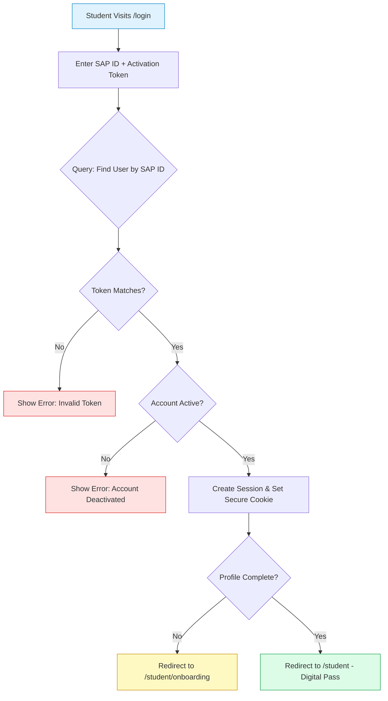
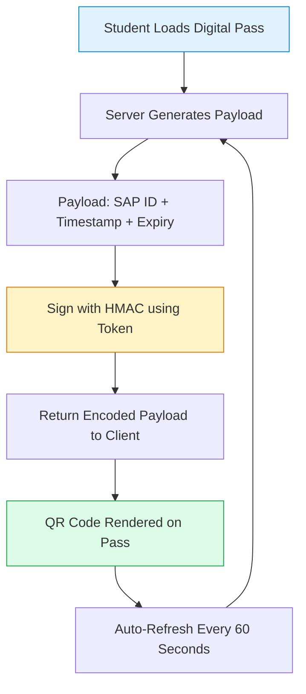
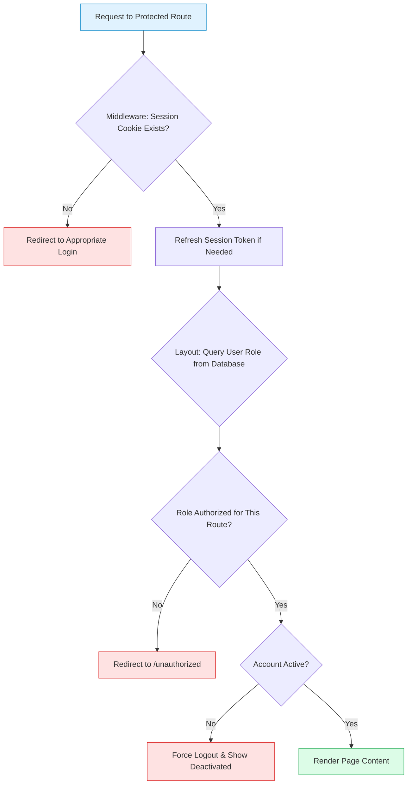
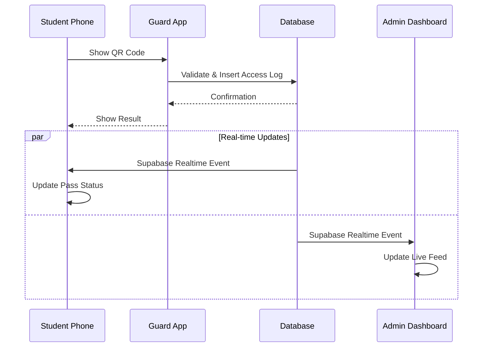

<div align="center">

# SENTINEL Web Application

### Complete Operational Flow Documentation

**A comprehensive guide to understanding every aspect of the SENTINEL web platform, designed for technical and non-technical stakeholders alike.**

</div>

---

## Table of Contents

1. [Introduction](#introduction)
2. [User Journey Overview](#user-journey-overview)
3. [Student Experience](#student-experience)
4. [Manager Portal](#manager-portal)
5. [Administrator Dashboard](#administrator-dashboard)
6. [Security Mechanisms](#security-mechanisms)
7. [Technical Flow Diagrams](#technical-flow-diagrams)

---

## Introduction

The SENTINEL web application serves as the primary interface for event management, student registration, and digital pass distribution. This document walks through every user interaction, explaining what happens behind the scenes and why each step matters.

### Who Accesses the Web Application?

| User Type                  | Primary Purpose                                                        |
| -------------------------- | ---------------------------------------------------------------------- |
| Students                   | Claim their digital pass and display it for venue entry                |
| Class Representatives (CR) | Register male students and track their roster                          |
| Girls Representatives (GR) | Register female students and track their roster                        |
| Super Administrators       | Oversee the entire system, manage all users, and monitor live activity |

---

## User Journey Overview

When someone visits the SENTINEL web application, they encounter a landing page presenting three clear pathways:

### Landing Page Portals

1. **Student Portal** — Access your digital pass
2. **Staff Portal** — Manager login for CRs and GRs
3. **Command Center** — Administrator system access

If a user is already logged in, the system automatically redirects them to their appropriate dashboard based on their role, eliminating unnecessary navigation steps.

---

## Student Experience

The student journey is deliberately streamlined to minimize friction while maintaining security. Students do not require traditional passwords; instead, they authenticate using credentials provided by their section manager.

### Step 1: Obtaining Login Credentials

Before a student can access their digital pass, a Class Representative or Girls Representative must register them in the system. Upon registration, two critical pieces of information are generated:

- **SAP ID**: The university-issued student identification number
- **Activation Token**: A unique six-character code that serves as the student's password

The manager communicates these credentials to the student, typically after confirming payment collection.

### Step 2: First-Time Login

When a student visits the Student Portal and enters their SAP ID and Activation Token:

1. The system verifies the credentials against the database
2. A secure session is established using HTTP-only cookies
3. The student is directed to complete their profile if incomplete

#### What is Profile Completion?

First-time users must provide additional information required for identity verification at the venue:

- **Full Name**: Displayed on the digital pass and verified by security
- **Gender**: Determines which gate the student should use (Male/Female lanes)
- **Profile Photo**: Uploaded and compressed for visual verification
- **University Card Photo**: Required for additional identity confirmation

All uploaded images are automatically compressed to optimize storage and loading performance.

### Step 3: Digital Pass Display

After profile completion, students access their personalized digital pass. This is not a static image but an interactive, animated experience:

#### Pass Design Philosophy

The digital pass mimics a physical event lanyard:

- **Lanyard Straps**: Animated SVG straps respond to dragging gestures with realistic physics
- **Card Body**: Displays the event branding and QR code on the front
- **Flip Interaction**: Tapping or clicking the card flips it to reveal student identity information

#### QR Code Security

The QR code displayed on the pass is not a simple identifier. It contains a cryptographically signed payload that includes:

```
SAP ID + Timestamp + Cryptographic Signature
```

The signature is generated using the student's secret Activation Token, which means:

- Screenshots of someone else's pass will not work (wrong signature)
- Old screenshots expire (timestamp validation)
- The token never appears in the QR code itself

QR codes refresh automatically every 60 seconds to maintain security while balancing server load.

### Step 4: Venue Entry

When the student arrives at the venue:

1. They open their digital pass on their phone
2. A security guard scans the QR code using the SENTINEL Guard mobile app
3. The system validates the signature and checks the student's status
4. Upon approval, the pass automatically flips to show an "APPROVED" stamp
5. The student's entry is logged with timestamp for tracking

#### Offline Capability

SENTINEL is built as a Progressive Web App (PWA), meaning students can add it to their home screen and access their pass even without internet connectivity. The most recently loaded QR code remains functional for scanning.

### Step 5: Exit and Re-Entry

When a student scans out at exit:

1. Their status changes from "INSIDE" to "OUTSIDE"
2. The pass updates to show an "OUTSIDE" stamp
3. They can re-enter by scanning again at an entry gate

The system tracks whether a student has entered before, distinguishing between:

- **First Entry**: Standard admission flow
- **Re-Entry**: Acknowledgment that the student is returning after a previous exit

---

## Manager Portal

Class Representatives and Girls Representatives access a dedicated portal designed for efficient student management and financial accountability.

### Authentication

Managers authenticate using traditional email and password credentials. The system enforces:

- **Role Verification**: Only users with CR, GR, or SUPER_ADMIN roles can access this portal
- **Rate Limiting**: After five failed login attempts, the account is locked for 15 minutes
- **Audit Logging**: Every login attempt (successful or failed) is recorded

### Manager Dashboard

Upon successful login, managers see their dedicated workspace:

#### Statistics Overview

The dashboard displays real-time metrics:

- Total students registered by this manager
- Breakdown by payment status
- Recent registration activity

#### Issue New Pass

The primary function is registering new students. The process:

1. Enter the student's SAP ID
2. Enter the student's full name
3. Confirm payment collection status
4. Submit the registration

Upon submission:

1. A unique Activation Token is generated
2. A database record is created linking this student to the manager
3. The manager can communicate credentials to the student

#### My Roster (Ledger)

A comprehensive table displays every student registered by this manager:

| Column     | Description                          |
| ---------- | ------------------------------------ |
| Name       | Student's registered name            |
| SAP ID     | University identification number     |
| Status     | Active, Inactive, or Payment Pending |
| Registered | Date and time of registration        |

This view provides financial accountability—if questions arise about who collected payment from a specific student, the ledger provides clear answers.

#### Profile Management

Managers can update their own account details:

- Change password
- Update email address
- View account activity

---

## Administrator Dashboard

Super Administrators have complete visibility and control over the entire SENTINEL system. The administrative interface is organized into logical sections accessible via a sidebar navigation.

### Dashboard Overview

The main dashboard provides at-a-glance system health metrics:

#### Key Performance Indicators

| Metric         | Description                            |
| -------------- | -------------------------------------- |
| Total Students | Complete count of registered students  |
| Present Now    | Students currently inside the venue    |
| Entry Rate     | Entries per hour for capacity planning |
| Payment Status | Breakdown of paid vs. pending students |

#### Live Activity Feed

A real-time stream of scan activity showing:

- Student name and SAP ID
- Entry or Exit type
- Timestamp
- Approval or rejection status

### Student Management

Comprehensive student administration capabilities:

#### Search and Filter

Administrators can locate specific students using multiple criteria:

- SAP ID lookup
- Name search
- Section filter
- Payment status filter
- Active/Inactive status

#### Individual Actions

For each student, administrators can:

- **View Details**: Complete profile information
- **Manual Check-In**: Override for emergency situations (creates audit log entry)
- **Toggle Payment Status**: Mark as paid or pending
- **Deactivate Account**: Prevent access without deleting records

#### Bulk Operations

For large-scale management:

- **CSV Import**: Upload student lists for rapid initial population
- **Export Attendees**: Download list of currently present students for emergency situations

### Manager Management

Administrators create and manage CR/GR accounts:

#### Creating a Manager

1. Specify email address for login
2. Assign role (CR for male sections, GR for female sections)
3. Designate section assignment (optional)
4. Set initial password

The system creates both authentication credentials and a linked database profile.

#### Manager Oversight

| Action          | Purpose                                  |
| --------------- | ---------------------------------------- |
| View Ledger     | See all students this manager registered |
| Edit Assignment | Change section or role                   |
| Deactivate      | Prevent login while preserving history   |
| Reset Password  | Generate new credentials                 |

### Guard Management

Security personnel require accounts to use the mobile scanning application:

#### Creating a Guard

1. Specify email address for login
2. Set password
3. Assign with GUARD role

Guards cannot access the web administrative interface—their accounts are exclusively for the mobile application.

### Live Monitoring

Real-time venue activity visualization:

#### Current Capacity

- Live count of present attendees
- Visual capacity indicator if maximum is set
- Gender-based breakdown for lane management

#### Entry/Exit Log

Streaming display of all scan activity with ability to:

- Filter by time range
- Search for specific students
- Identify anomalies (rejected scans, duplicate attempts)

### Audit Trail

Complete history of administrative actions:

| Logged Information | Purpose                                                 |
| ------------------ | ------------------------------------------------------- |
| Performer          | Which administrator performed the action                |
| Action Type        | What was done (login, user edit, manual check-in, etc.) |
| Target             | Who was affected by the action                          |
| Timestamp          | When the action occurred                                |
| IP Address         | Network location of the performer                       |
| User Agent         | Browser/device information                              |

Audit logs are immutable—they can be viewed but not modified or deleted.

### System Settings

Global configuration options:

| Setting          | Description                    |
| ---------------- | ------------------------------ |
| Event Name       | Displayed on student passes    |
| Event Date       | Used for date-based validation |
| Venue            | Shown on pass back side        |
| Maximum Capacity | Optional cap for admission     |
| Ticket Price     | Default registration cost      |

---

## Security Mechanisms

SENTINEL implements defense-in-depth security principles throughout the web application.

### Authentication Flow

```
User Submits Credentials
         ↓
Supabase Auth Validates
         ↓
Session Cookie Set (HTTP-only)
         ↓
Middleware Checks Cookie on Protected Routes
         ↓
Layout Component Verifies Role from Database
         ↓
Page Renders if Authorized
```

### Route Protection

The application uses layered protection:

1. **Edge Middleware**: Fast session presence check without database queries
2. **Layout Verification**: Database role validation for route groups
3. **Action Guards**: Each server action re-verifies authorization

### Rate Limiting

Brute-force protection tracks failed login attempts:

- **Window**: 15 minutes
- **Threshold**: 5 failed attempts
- **Action**: Account lockout with remaining time display

### CSRF Protection

API routes validate request origins:

- Origin header must match application host
- Referer header checked as fallback
- Mismatched origins receive 403 Forbidden

### Input Validation

All form submissions are validated using Zod schemas:

- Email format verification
- Password minimum length requirements
- SAP ID format constraints
- File type and size limits for uploads

---

## Technical Flow Diagrams

### Student Authentication Flow



### QR Code Generation Flow



### Access Control Decision Flow



### Complete User Registration Flow

```mermaid
flowchart LR
    subgraph Manager["Manager Portal"]
        M1[Manager Logs In] --> M2[Issue New Pass]
        M2 --> M3[Enter Student SAP ID & Name]
        M3 --> M4[Confirm Payment Collection]
        M4 --> M5[Generate Activation Token]
    end

    subgraph Student["Student Portal"]
        S1[Student Receives Credentials] --> S2[Login with SAP ID + Token]
        S2 --> S3[Complete Profile]
        S3 --> S4[Upload Photo & ID Card]
        S4 --> S5[Access Digital Pass]
    end

    subgraph Venue["Event Venue"]
        V1[Show QR Code to Guard] --> V2[Guard Scans with Mobile App]
        V2 --> V3{Validation}
        V3 -->|Approved| V4[Entry Granted - Pass Shows APPROVED]
        V3 -->|Rejected| V5[Entry Denied - Reason Displayed]
    end

    M5 --> S1
    S5 --> V1

    style M5 fill:#dbeafe,stroke:#2563eb
    style S5 fill:#dcfce7,stroke:#16a34a
    style V4 fill:#dcfce7,stroke:#16a34a
    style V5 fill:#fee2e2,stroke:#dc2626
```



### Real-Time Data Synchronization



---

## Real-Time Updates

The web application maintains live connections for instant updates:

### Supabase Realtime

When a student's pass is scanned:

1. Guard app inserts record into `access_logs` table
2. Supabase broadcasts change to subscribed clients
3. Student's Digital Pass component receives the event
4. Pass automatically flips and displays updated status
5. Administrator dashboard live feed updates

This enables a seamless verification experience where the student sees their approval status change the moment the guard confirms entry.

---

## Error Handling

The application provides graceful degradation and clear user feedback:

### Network Errors

- Offline detection triggers visual indicator
- PWA caching ensures pass remains accessible
- Retry logic for transient failures

### Authentication Errors

- Clear messages for invalid credentials
- Rate limiting feedback with remaining lockout time
- Session expiration with redirect to login

### Validation Errors

- Field-level error highlighting
- Descriptive messages for correction guidance
- Prevention of invalid data submission

---

## Conclusion

The SENTINEL web application provides a complete lifecycle for university event access management:

1. **Administrators** configure the event and create staff accounts
2. **Managers** register students and distribute credentials
3. **Students** access their secure digital passes
4. **Guards** verify entry using the companion mobile application
5. **Administrators** monitor activity and maintain audit compliance

Every interaction is logged, secured, and designed for both usability and accountability.

---

<div align="center">

**SENTINEL Web Application Documentation**

For mobile application flow, see [App.md](./App.md)

</div>
